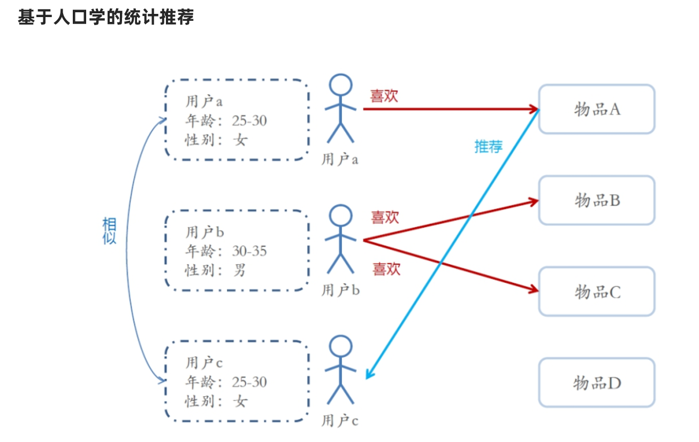
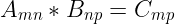
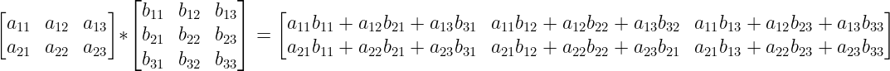
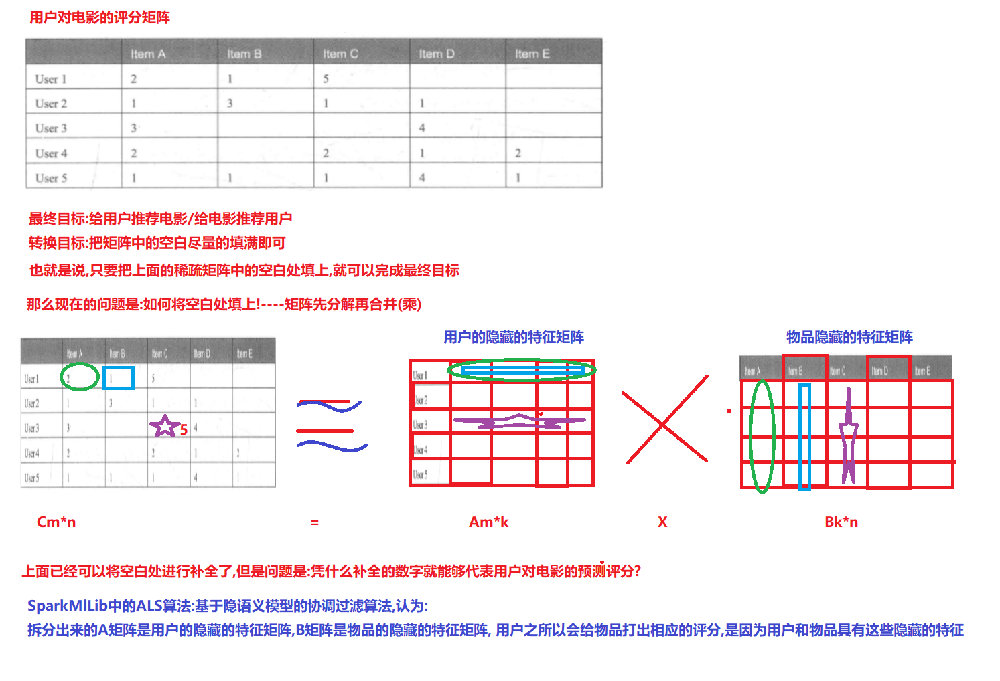

# 推荐系统
## 概述
> 数据+挖掘 ==> 模型(用户特征) --> 推荐
---
## Lambda架构

> 流处理+批处理的混合平台

### 批处理

- Flume 收集
- HDFS 分布式文件存储
- MapReduce & Spark 计算

### 流处理

- Flume & Kafka 收集

- Spark Streaming & Flink 计算

## 冷启动

### 用户冷启动
- 用户自主填写信息，选择标签
- 推荐流行
### 物品冷启动
- 物品打标签
- 基于内容推荐
### 系统冷启动
- 缺少用户行为数据 ->基于内容的推荐
- 过度到 **协同过滤**
- 多种算法结合使用

---
## 数据采集

### 数据分类

- 显示评分：类似豆瓣，用户对内容评分，int值，**余弦或者皮尔逊相关系数**
- 隐式评分：类似抖音，用户是否感兴趣，Boolean值，**杰卡德相似度**

### 用户评分矩阵

- 稠密矩阵
  - 计算**向量相似度**
  - 协同过滤

- 稀疏矩阵
  - 矩阵拆分

---

## 特征工程

> 准备数据

- 协同过滤：U(user)I(item)评分矩阵
- 基于内容：分词，tf-idf，word2Vec

---

## 算法分类

### 基于用户的推荐
> 将用户分类，推荐同一类用户喜欢的内容

### 基于内容的推荐
> 将内容分类，根据用户喜欢的内容，推荐同一类的内容

#### 描述分词，计算词权重，提取关键词

##### TF-IDF 词权重

> TF：词频
>
> IDF：逆文档频率

- t 单词
- d 文档
- corpus 总文档数

$$
TF-IDF =TF \times IDF\\
TF = \frac {t出现的次数} {d中单词总数}\\
IDF = \log_{10}(\frac {corpus} {t出现的文档数})
$$

- 如果一个单词在每一篇文章都出现了,则 *IDF=0*,则TF-IDF=0

#### 关键词转化关键词向量

- word2Vec 词 -> 词向量

#### 关键词向量构建物品向量

- 1（item）对多（关键词向量）
- 加权平均

#### 计算物品相似度 

- 皮尔逊相关系数

### 协同过滤

#### 基于用户的协同过滤
> 根据用户的喜欢将用户分类（行为数据），推荐同一类用户喜欢的内容

#### 基于用户的协同过滤
> 根据用户的喜欢将内容分类，推荐同一类的内容

### ALS 算法

>基于隐语义模型的协同过滤算法
#### 数学基础
- 矩阵
- 矩阵乘法
> 矩阵C的行数等于矩阵A的行数，C的列数等于B的列数

#### 总结
1. 将用户和内容的稀疏评分矩阵拆分成两个矩阵
2. 矩阵A代表用户的*隐藏特征矩阵*
3. 矩阵B代表内容的*隐藏特征矩阵*
4. 将AB矩阵相乘，获得预测的*评分矩阵*

