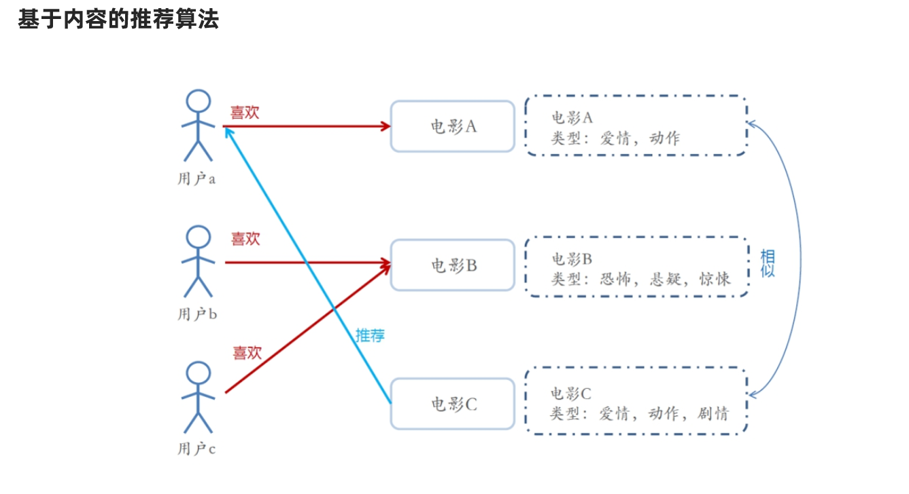
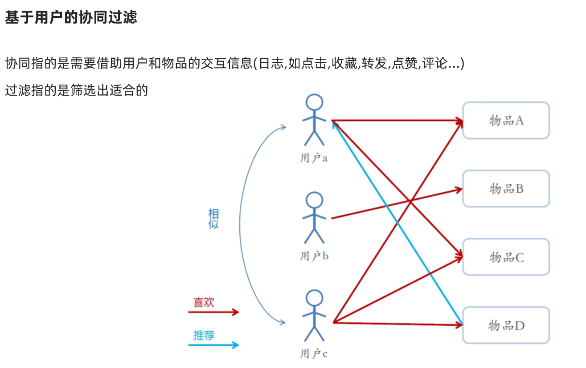

# 推荐系统
## 概述
> 数据+挖掘 ==> 模型(用户特征) --> 推荐
---
## 算法分类
### 基于用户的推荐
> 将用户分类，推荐同一类用户喜欢的内容

### 基于内容的推荐
> 将内容分类，根据用户喜欢的内容，推荐同一类的内容

### 基于用户的协同过滤
> 根据用户的喜欢将用户分类（行为数据），推荐同一类用户喜欢的内容

### 基于用户的协同过滤
> 根据用户的喜欢将内容分类，推荐同一类的内容

###ALS 算法
>基于隐语义模型的协同过滤算法
#### 数学基础
- 矩阵
- 矩阵乘法
> 矩阵C的行数等于矩阵A的行数，C的列数等于B的列数

#### 评分
- 显示评分：类似豆瓣，用户对内容评分，int值
- 隐式评分：类似抖音，用户是否感兴趣，Boolean值

#### 总结
1. 将用户和内容的稀疏评分矩阵拆分成两个矩阵
2. 矩阵A代表用户的*隐藏特征矩阵*
3. 矩阵B代表内容的*隐藏特征矩阵*
4. 将AB矩阵相乘，获得预测的*评分矩阵*

